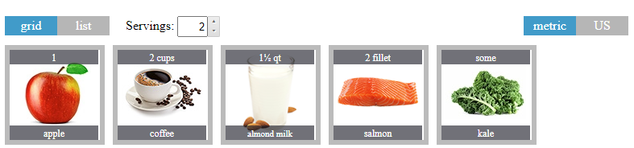
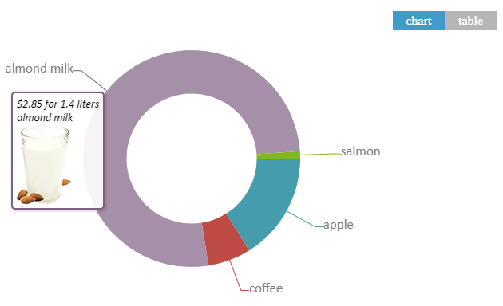
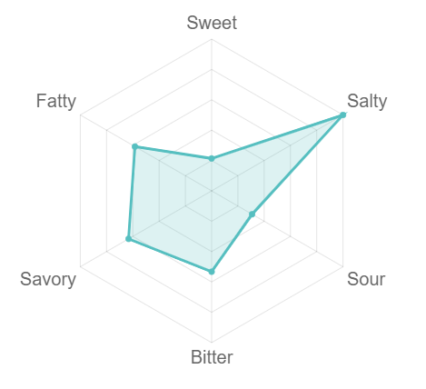
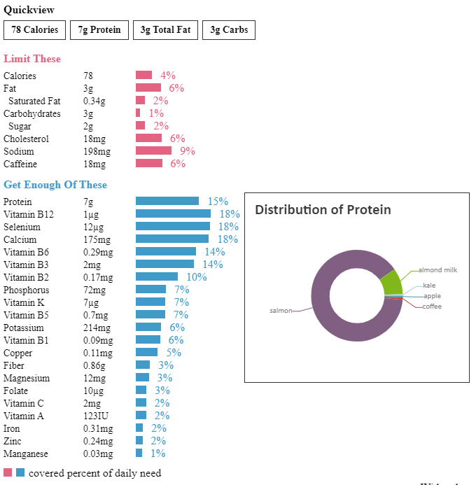
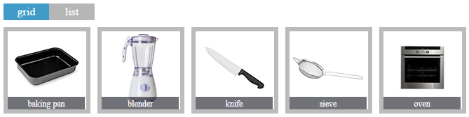

# spoonacular widgets
spoonacular offers a variety of widgets that allow you to work with food data. To use everything spoonacular's API has to offer have a look at spoonacular's [food and nutrition API](https://spoonacular.com/food-api).

## Ingredient Widget
The spoonacular ingredient visualizer widget lets you show a recipe's ingredient list in a visually appealing way. The viewer can also decide between US and metric measurements and scale the recipe up and down. Check out the file [ingredientWidget.html](ingredientWidget.html) for a demo.

## Price Breakdown Widget
The spoonacular price visualizer widget lets you show the total estimated cost for a recipe. You can even see the costs broken down by ingredient. Check out the file [priceWidget.html](priceWidget.html) for a demo.

## Taste Widget
The spoonacular taste visualizer widget lets you display the taste distribution of an ingredient or an entire recipe. Currently, the tastes sweet, salty, sour, bitter, savory (umami), and fatty are supported. Check out the file [tasteWidget.html](tasteWidget.html) for a demo.

## Nutrition Widget
The spoonacular nutrition visualizer widget lets you display macro and micro nutrients of a recipe. By hovering over the bars you can even see which ingredients contribute most to the nutrient. Check out the file [nutritionWidget.html](nutritionWidget.html) for a demo.

## Equipment Widget
The spoonacular equipment visualizer widget lets you show the tools required to make recipe in a visually appealing way. Check out the file [equipmentWidget.html](equipmentWidget.html) for a demo.

If you have questions, check our [FAQ](https://spoonacular.com/food-api/faq) or just [reach out](https://spoonacular.com/food-api/).